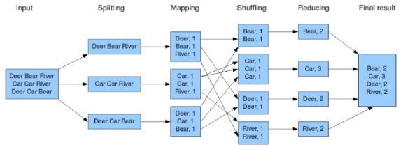

<p align="center">
  <a href="" rel="noopener">
 </a>
 <br>

</p>

<h3 align="center">Hadoop Tutorial</h3>

<div align="center">

[]()
[](https://github.com/da-huin/hadoop-tutorial/issues)
[](https://github.com/da-huin/hadoop-tutorial/pulls)
[](/LICENSE)

</div>

---

<p align="center"> 
    <br> Tutorial of Hadoop and Hbase.
</p>

## 📝 Table of Contents

- [Getting Started](#getting_started)
- [Acknowledgments](#acknowledgement)

## 🏁 Getting Started <a name = "getting_started"></a>

This document explains how to install Hadoop and Hbase and how to basic use it.

## Using Hadoop in Docker
---

### **Please follow the step below to know the basic usage.**

1. **Run Docker Hadoop.**

    ```
    docker run -it sequenceiq/hadoop-docker:2.7.0 /etc/bootstrap.sh -bash
    ```

1. **Run MapReduce and check output.**

    ```bash
    cd $HADOOP_PREFIX
    # run the mapreduce
    bin/hadoop dfsadmin -safemode leave
    bin/hadoop jar share/hadoop/mapreduce/hadoop-mapreduce-examples-2.7.0.jar grep input output 'dfs[a-z.]+'

    # check the output
    bin/hdfs dfs -cat output/*
    ```

1. **Create directory and put file.**

    ```bash
    >>> bin/hadoop fs -mkdir /hello
    >>> bin/hadoop fs -put ./NOTICE.txt /hello

    >>> bin/hadoop fs -ls /hello
    Found 1 items
    -rw-r--r--   1 root supergroup        101 2020-08-18 09:10 /hello/NOTICE.txt

    ```

1. **Read File.**

    ```bash
    >>> bin/hadoop fs -cat /hello/NOTICE.txt
    This product includes software developed by The Apache Software
    Foundation (http://www.apache.org/).
    ```

1. Complete!


### **Reference**

1. **HDFS is hadoop distribution file system.**

1. **Hadoop consists of:**
    
    **Node**

    1. Name Node
        * Manage Metadata (Block informations and Datanode Informations)
        * Manage DataNode (Heartbeat - 3s and Blockreport - 6h)
    2. Data Node

    **Block**

    1. Block size 128MB
    2. The reason a block size is large is to search quickly.

    **Safe Mode**

    1. Safemode is state in which data nodes cannot be modified.
    2. How to change safe mode
        
        ```bash
        # Get safe mode state.
        $ hdfs dfsadmin -safemode get
        Safe mode is OFF

        # Safe mode enter.
        $ hdfs dfsadmin -safemode enter
        Safe mode is ON

        # Safe mode leave.
        $ hdfs dfsadmin -safemode leave
        Safe mode is OFF
        ```

1. **Mapreduce**

    MapReduce is a system to process data of Hadoop cluster and consists of Map and Reduce.

    

## Using Hadoop(Hbase) in python
---

### **Please follow the step below to know the basic usage.**

1. **Run Docker hbase.**

    ```bash
    mkdir -p data

    docker run -p 16010:16010 -p 9090:9090 -p 9095:9095 -p 8080:8080 -p 8085:8085 -p 2181:2181 --name=hbase-docker -h hbase-docker -d -v $pwd/data:/data dajobe/hbase
    ```

1. **Connect hbase and create table.**

    ```python
    import happybase

    connection = happybase.Connection('localhost', 9090)
    connection.create_table('sample', {'family': dict()})
    print(connection.tables())
    ```


1. **Connect table and put data and read data**

    ```python
    table = connection.table('sample')
    table.put('row-key', {'hello':'world', 'yellow': 'banana'})
    for k, data in table.scan():
        print(k, data)
    ```

1. **Run docker shell to check**

    ```bash
    docker exec -it hadoop-docker hbase shell
    ```

1. **scan table**

    ```bash
    scan 'sample'
    ```
### **Reference**

1. **What is HBase?**

    HBase is non-relational distribution database for Hadoop platform. It runs on `HDFS`.

1. **What is HappyBase?**

    Happy Base is a library to use HBase in Python. It runs on `Apache Thrift`

1. **What is Apache Thrift?**

    Thrift is Interface Definition Language.

    It has been developed by Facebook for `Scalable Cross-Language Service Development`.

## **Tutorial is over 😀**
